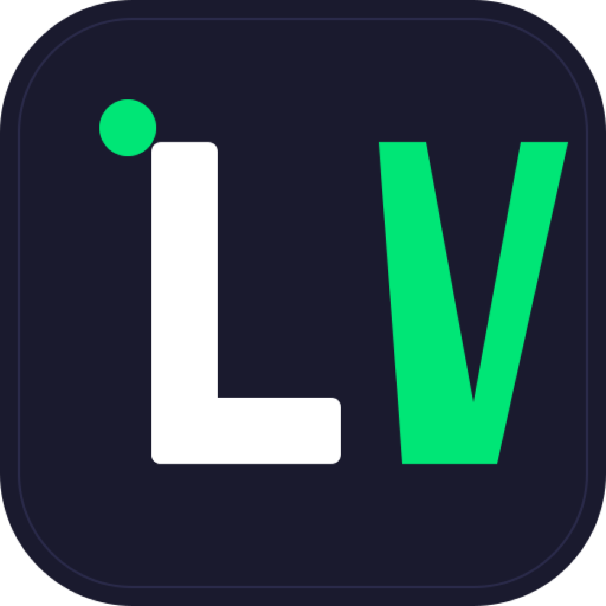
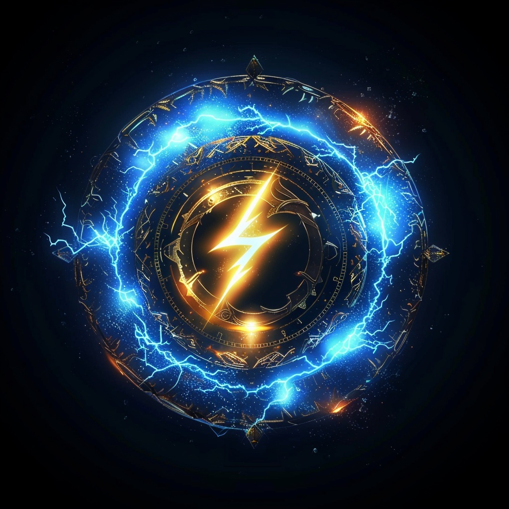
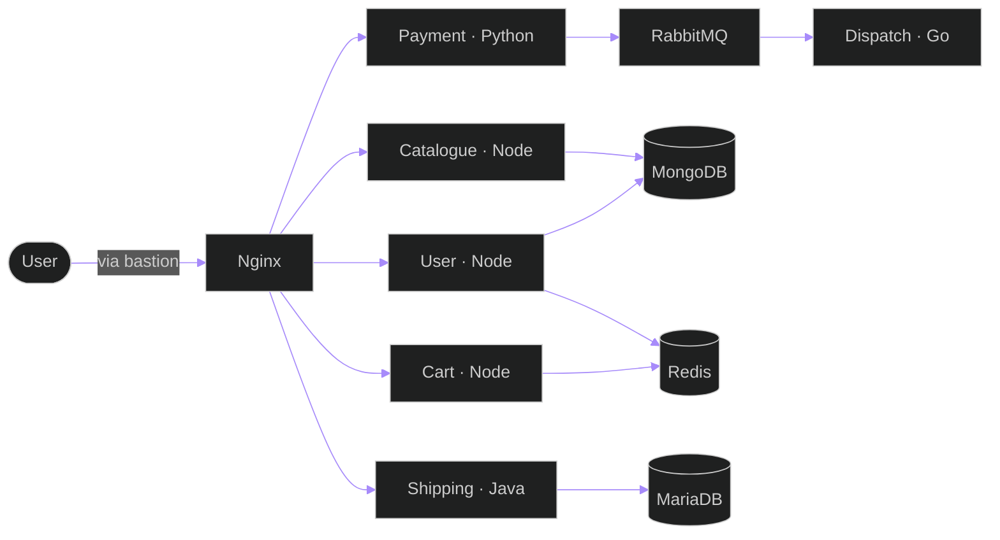
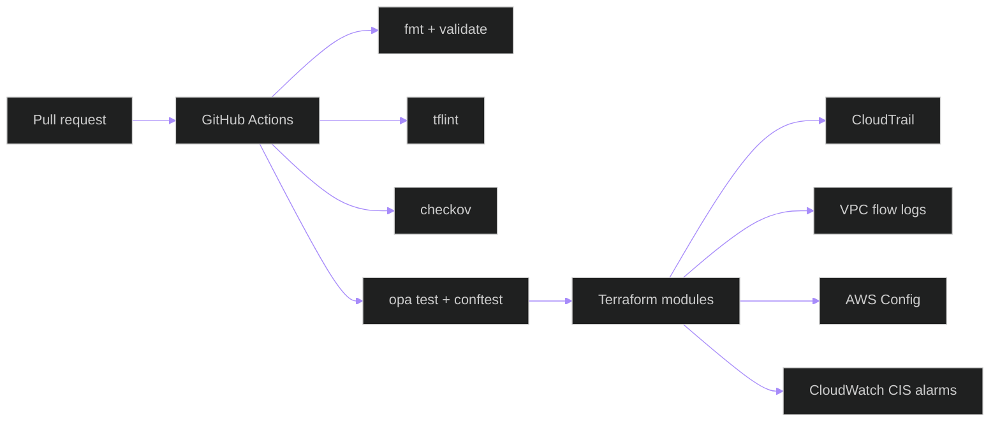
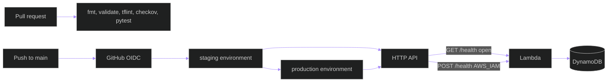
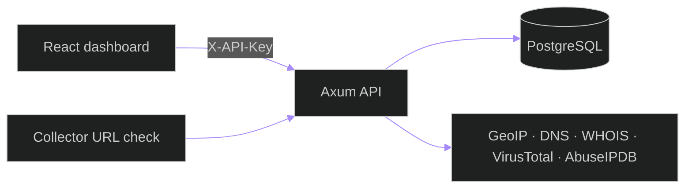
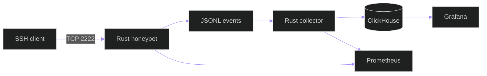
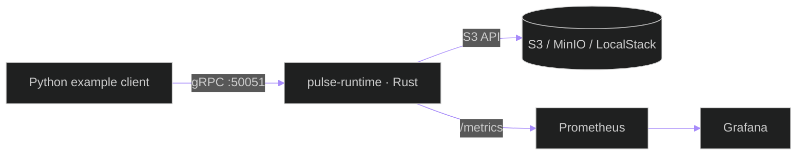
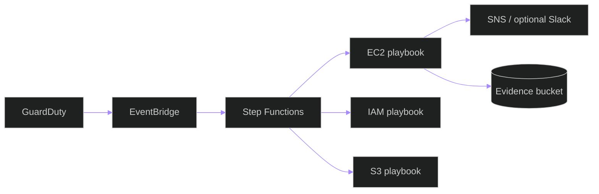

<!-- ═══════════════════════════════════════════════════════════════ -->
<!-- ANIMATED HEADER                                                 -->
<!-- ═══════════════════════════════════════════════════════════════ -->


<p align="center">
  <a href="https://github.com/lloredia">
    
  </a>
</p>

<p align="center">
  
  
  
</p>

---

```bash
$ ssh lesley@github.com
Welcome to lloredia

  * Documentation:  https://github.com/lloredia
  * Roles:          DevOps · SRE · DevSecOps
  * Public code:    AWS labs, Rust security tools, teaching notes

$ whoami
lesley
```

```text
 ██╗     ███████╗███████╗██╗     ███████╗██╗   ██╗
 ██║     ██╔════╝██╔════╝██║     ██╔════╝╚██╗ ██╔╝
 ██║     █████╗  ███████╗██║     █████╗   ╚████╔╝
 ██║     ██╔══╝  ╚════██║██║     ██╔══╝    ╚██╔╝
 ███████╗███████╗███████║███████╗███████╗   ██║
 ╚══════╝╚══════╝╚══════╝╚══════╝╚══════╝   ╚═╝
                          ╔════════════════════════════════════════════╗
                          ║  lesley@cloud ~ %                          ║
                          ╠════════════════════════════════════════════╣
   ╭─◉─╮                  ║  Roles..... DevOps · SRE · DevSecOps       ║
  ╱ DEV ╲                 ║  Focus..... IaC, detection, response       ║
 │  SEC  │                ║  Clouds.... AWS · Azure · GCP · OCI        ║
  ╲ OPS ╱                 ║  IaC....... terraform · ansible            ║
   ╰─◉─╯                  ║  Langs..... python · rust · go · ts · bash ║
     │                    ║  Labs...... CIS controls · NIST IR         ║
   ╔═╧═╗                  ║  Certs..... SAA · Sec+ · Net+ · ITIL       ║
   ║ λ ║                  ║  Studying.. CISM · CEH · SCS · AZ-500      ║
   ╚═╤═╝                  ║  Also....... CHFI · GMON · PCCSE · ZCCP    ║
     │                    ║  Coffee.... ready                          ║
  ┌──┴──┐                 ║  Status.... open to roles                  ║
  │ ░░░ │                 ║                                            ║
  └─────┘                 ╚════════════════════════════════════════════╝
```

> `// TODO: ship secure code, automate the boring stuff, sleep at night`

I publish infrastructure labs, detection tooling, and small products. The notes under Featured Projects describe the public repositories as they are on the default branch.

---

### 🔧 What I Do

- 🏗️ Build AWS infrastructure with Terraform and Ansible
- ♾️ Add CI that formats, lints, tests, and policy-checks before anything is applied
- 🐳 Package lab services with Docker and Compose
- 📈 Wire Prometheus and Grafana into local security and checkpoint stacks
- 🔐 Keep lab secrets in SSM SecureString parameters and Ansible Vault, and scan git with gitleaks where the workflow does
- 🛡️ Practice detection and response: honeypot logs, a GuardDuty isolation lab, and a local incident console

---

### 🚢 Apps I Ship

> Six products. Linked cards open a public page.

<table align="center">
  <tr>
    <td align="center" width="16%">
      <a href="https://apps.apple.com/us/app/pro-gains/id6761289622">
        <br/>
        <b>PRo Gains</b>
      </a><br/>
      <sub>iOS · App Store<br/>workout tracker</sub>
    </td>
    <td align="center" width="16%">
      <a href="https://www.liveview-tracker.com/">
        <br/>
        <b>LiveView</b>
      </a><br/>
      <sub>live sports scores<br/>soccer, basketball, hockey, baseball</sub>
    </td>
    <td align="center" width="16%">
      <br/>
      <b>RentFlow</b><br/>
      <sub>rental product</sub>
    </td>
    <td align="center" width="16%">
      <a href="https://lloredia.github.io/Gods-Of-The-Realms-War-of-Worlds/">
        <br/>
        <b>Gods Of The Realms</b>
      </a><br/>
      <sub>playable in the browser<br/>Next.js gacha RPG</sub>
    </td>
    <td align="center" width="16%">
      <a href="https://github.com/lloredia/night-list">
        <br/>
        <b>Night List</b>
      </a><br/>
      <sub>React dashboard + SwiftUI<br/>sample data, not deployed</sub>
    </td>
    <td align="center" width="16%">
      <a href="https://lesleads.com">
        <br/>
        <b>LesLeads</b>
      </a><br/>
      <sub>consulting firm · job applications<br/>client &amp; specialist dashboards at app.lesleads.com</sub>
    </td>
  </tr>
</table>

---

### 🛠️ Tech Stack

```yaml
# toolkit — tools I work with
# project sections below are limited to what each public repo contains
clouds:        [aws, azure, gcp, oci]
iac:           [terraform, ansible, cloudformation, arm-templates]
ci_cd:         [github-actions, gitlab-ci, jenkins, azure-devops]
containers:    [docker, kubernetes, eks, aks, gke, helm]
security:
  platforms:   [zscaler, palo-alto-prisma, ms-defender, crowdstrike]
  scanning:    [snyk, trivy, tfsec, checkov, semgrep, gitleaks]
  policy:      [opa, sentinel, conftest]
siem:          [splunk, qradar, elastic, microsoft-sentinel]
identity:      [aws-iam, kms, azure-key-vault, vault]
observability: [datadog, prometheus, grafana, dynatrace, loki, tempo]
languages:     [python, go, rust, typescript, bash, powershell]
compliance:    [cis, nist, soc2, hipaa, hitrust, pci-dss, mitre-attack]
os:            [linux, kali, rhel, windows-server]
```

<details>
<summary><b>☁️ Cloud Platforms</b></summary>


</details>

<details>
<summary><b>🏗️ Infrastructure as Code</b></summary>


</details>

<details>
<summary><b>♾️ CI/CD & Automation</b></summary>


</details>

<details>
<summary><b>🐳 Containers & Orchestration</b></summary>


</details>

<details>
<summary><b>🛡️ Security tooling</b></summary>


</details>

<details>
<summary><b>🚨 SIEM & Threat Detection</b></summary>


</details>

<details>
<summary><b>🔑 Identity, Secrets & Policy</b></summary>


</details>

<details>
<summary><b>📈 Monitoring & Observability</b></summary>


</details>

<details>
<summary><b>💻 Languages</b></summary>


</details>

<details>
<summary><b>📋 Compliance & Frameworks</b></summary>


</details>

<details>
<summary><b>🐧 Operating Systems</b></summary>


</details>

---

### 📜 Certifications

```bash
$ keychain list --certs
```

```text
┌─────────────────────────── 🔐 ~/.credentials/ ───────────────────────────┐
│                                                                         │
│  ID            ISSUER          STATUS              DOMAIN               │
│  ───────────── ─────────────── ─────────────────── ───────────────────  │
│  AWS-SAA       Amazon          Earned              cloud · exp. 2027    │
│  Security+     CompTIA         Earned              foundations          │
│  Network+      CompTIA         Earned              networking           │
│  ITIL v4       AXELOS          Earned              operations           │
│  CISM          ISACA           In progress         governance           │
│  CEH           EC-Council      In progress         offensive            │
│  CHFI          EC-Council      In progress         forensics · Q4 2026  │
│  GMON          GIAC            In progress         blue team · Q4 2026  │
│  AWS-SCS       Amazon          In progress         cloud security       │
│  AZ-500        Microsoft       In progress         cloud security       │
│  PCCSE         Palo Alto       In progress         cloud security       │
│  ZCCP-PA       Zscaler         In progress         zero trust · Q4 2026 │
│                                                                         │
└─────────────────────────────────────────────────────────────────────────┘
```

```text
 2019       2020        2021        2024
 Network+   Security+   ITIL v4     AWS-SAA

 In progress, no date:  CISM · CEH · AWS-SCS · AZ-500 · PCCSE
 In progress, Q4 2026:  CHFI · GMON · ZCCP-PA
```

---

### 🚀 Featured Projects

Public repositories only. Descriptions match the code on the default branch.

#### 🛒 [RoboShop — AWS microservices lab](https://github.com/lloredia/RoboShop)

Terraform and Ansible lab for a multi-service shop on AWS. Applying it creates a VPC, **12 EC2 instances**, and **11** private Route53 A records. The GitHub repo description still says 8 instances; the Terraform does not.



**What the code does**
- Instances: bastion, MongoDB, MariaDB (DNS name `mysql`), Redis, RabbitMQ, Nginx frontend, and Node.js catalogue, user, and cart, plus Java shipping, Python payment, and a Go dispatch worker
- Private zone records for those 11 services. The bastion is not in the zone
- SSM `SecureString` parameters (customer-managed KMS key) for generated passwords. Ansible secrets live in a gitignored Vault file (`group_vars/all/vault.yml`)
- CI on the repo: `terraform fmt`, `terraform validate`, tflint, checkov, yamllint, and ansible-lint

**Tech:** `Terraform` `Ansible` `AWS VPC` `EC2` `Route53` `SSM` `KMS` `Nginx` `Node.js` `Java` `Python` `Go` `MongoDB` `MariaDB` `Redis` `RabbitMQ`

---

#### 🛡️ [Compliance-as-Code Framework](https://github.com/lloredia/Compliance-as-Code-Framework)

Single-account AWS Terraform modules aimed at CIS Foundations controls, plus policy checks that run in GitHub Actions. CI does not apply the stack.



**What the code does**
- Multi-region CloudTrail with log-file validation, KMS, CloudWatch Logs, and an SNS topic
- VPC flow logs, an IAM account password policy, account-level S3 Block Public Access, and encryption for buckets named in a variable
- An AWS Config recorder, a CIS-aligned conformance pack, and Config rules for open SSH and common ports
- CloudWatch metric filters and alarms for CIS 4.1–4.15
- Rego rules reject plans that open SSH or RDP to the internet, disable S3 Block Public Access, or create a single-region CloudTrail without log-file validation
- CI also runs ruff and pytest for `scripts/analyze-prowler.py`. tfsec is not in this workflow

**Tech:** `Terraform` `GitHub Actions` `AWS Config` `CloudTrail` `CloudWatch` `checkov` `tflint` `OPA` `conftest`

---

#### ⚡ [Serverless Health Check API](https://github.com/lloredia/serverless-health-check)

API Gateway HTTP API, a Python 3.11 Lambda, and DynamoDB, provisioned with Terraform. The repository is the pipeline. It does not publish a public production URL.



**What the code does**
- `GET /health` is unauthenticated and read-only. `POST /health` defaults to `AWS_IAM` (SigV4). JWT is an option; `NONE` would leave POST public
- Staging and production are separate Terraform tfvars and GitHub environments. Production waits on the `production` environment. There is no dev stage in the deploy workflow
- Deploy uses a GitHub OIDC role. Plan and apply are skipped until repository secrets for the role, state bucket, and lock table are set
- Tests use pytest and moto. The coverage gate in `pyproject.toml` is **90%** (`--cov-fail-under=90`), including branch coverage
- CI also runs ruff, pip-audit, and gitleaks, and checkov on `terraform/` and `bootstrap/`

**Tech:** `API Gateway HTTP API` `Lambda` `Python 3.11` `DynamoDB` `Terraform` `GitHub Actions` `GitHub OIDC` `checkov` `moto`

---

#### 🔎 [SentinelForge — threat intelligence service](https://github.com/lloredia/SentinelForge)

Rust (Axum, sqlx, PostgreSQL) API and a React (Vite) dashboard for storing and searching indicators. Enrichment covers GeoIP, DNS, WHOIS, VirusTotal, and AbuseIPDB. Feed collectors exist as libraries. `POST /api/v1/feeds/refresh` is authenticated and currently returns a stub; collection is not scheduled at startup.



**What the code does**
- IOC types include IP, CIDR, domain, URL, MD5/SHA1/SHA256, email, and CVE. Search is paginated `ILIKE` with wildcards escaped
- Write routes require an API key (`X-API-Key` or `Authorization: Bearer`). Read auth is optional and off by default
- CORS is an allowlist (`CORS_ALLOWED_ORIGINS`). A per-IP rate limit uses `governor`. Request body size and timeout limits are configured
- Collector base URLs reject link-local and metadata addresses, and reject loopback, RFC1918, and CGNAT unless private hosts are explicitly allowed. Feed URLs can be checked against an allowlist
- The API image is `gcr.io/distroless/cc-debian12:nonroot`. CI builds the API and UI images, fails Trivy on unfixed-ignored HIGH/CRITICAL findings, and runs gitleaks
- Compose also starts Redis. The API does not talk to it

**Tech:** `Rust` `Axum` `PostgreSQL` `React` `TypeScript` `Docker` `Trivy` `gitleaks`

---

#### 🍯 [HoneyTrap — SSH honeypot lab](https://github.com/lloredia/honeytrap)

One Compose stack: a Rust SSH honeypot, a Rust collector, ClickHouse, Prometheus, and Grafana. The honeypot speaks SSH on port 2222. It accepts passwords and answers from an emulated shell. It does not spawn a real shell, and commands such as `wget` return canned errors.



**What the code does**
- Events recorded include connections, auth, and commands. A Python helper can push source addresses to a SentinelForge API. That push is optional and not part of Compose
- Grafana, Prometheus, ClickHouse, and metrics ports bind to `127.0.0.1`. Port 2222 is published on all interfaces
- Honeypot and collector images run non-root with a read-only root filesystem, capabilities dropped, and `no-new-privileges`
- Sample events in the repo use documentation addresses from RFC 5737

**Tech:** `Rust` `Tokio` `Docker Compose` `ClickHouse` `Prometheus` `Grafana`

---

#### 💾 [PulseCheckpoint Runtime](https://github.com/lloredia/pulsecheckpoint-runtime)

A single-process **Rust** gRPC service (`tonic`) that stores checkpoint bytes in S3-compatible storage (AWS S3, MinIO, or LocalStack). Worker, dataset, and checkpoint indexes stay in memory. Restarting the process forgets registrations even if the objects remain in the bucket. The gRPC listener does not terminate TLS.



**What the code does**
- Register, heartbeat, list, and deregister workers. Save, get, list, and delete checkpoints, including a client-streaming upload. SHA-256 is stored and checked on read
- `PULSE_S3_ENDPOINT` points the AWS SDK at MinIO or LocalStack. Unset, it uses the regional AWS endpoint
- The example client and generated stubs are Python. The runtime is Rust
- The runtime image is distroless and runs as nonroot. `terraform/` is an unfinished dev sketch and is not planned or applied by CI
- Unit tests cover in-memory and filesystem storage. CI starts MinIO for the S3 round trip

**Tech:** `Rust` `tonic` `gRPC` `AWS SDK for S3` `MinIO` `Prometheus` `Grafana` `Python client`

---

#### 🚨 [Incident Response Automation Lab](https://github.com/lloredia/Incident-Response-Automation-Lab)

Terraform lab: GuardDuty findings match EventBridge rules, and Step Functions calls Python Lambda playbooks. Deploy it only in a sandbox. `enforce` mode can change real resources. `notify_only` records the action and leaves the resource alone.



**What the code does**
- EC2 findings: replace the instance security groups with a quarantine group, tag the instance, and snapshot attached EBS volumes
- IAM findings: deactivate the access key and attach a pre-created deny-all policy
- S3 findings: turn on all four S3 Block Public Access settings and tag the bucket
- Unmatched types and playbook errors notify and write evidence, and do not contain
- A forensics VPC is created with no internet gateway. Playbooks do not move instances into it
- CI runs ruff, pytest (moto for EC2, IAM, and S3), `terraform fmt`, `terraform validate`, tflint, and checkov. CI does not apply and does not need AWS credentials

**Tech:** `Terraform` `GuardDuty` `EventBridge` `Step Functions` `Lambda` `Python` `SNS` `checkov`

---

#### 🤖 [AutoSOC — local incident console](https://github.com/lloredia/AutoSOC)

Node.js API and React console. NexusWatch detection was merged into this repository. The demo loads sample HoneyTrap-style events and a local indicator JSON file, scores them, and walks matching playbooks. Response steps in the demo are mock actions. Sample alerts are enough to run the UI. A live HoneyTrap or SentinelForge service is not required.

**What the code does**
- Six playbooks: brute force, malware containment, data exfiltration, command-and-control, phishing, and privilege escalation. Phishing stays disabled until an analyst enables it
- Incident controls: pause, resume, abort, retry, escalate
- Optional Python bridge tails a HoneyTrap JSONL spool into `POST /api/events`
- State is in memory. `npm run dev` serves the UI on port 8080 and the API on port 8787

**Tech:** `Node.js` `React` `JavaScript` `Vite`

---

#### 📚 [devops — teaching modules](https://github.com/lloredia/devops)

Numbered learning modules, from the shell through Git, Python, Ansible, containers, a Kubernetes client note, Jenkins, platform-service notes, a cloud outline, security reading, and a short assembly intro (`01` through `11`). Examples are historical and often pin old packages. `archive/` is kept and is not coursework. GitHub Actions runs ShellCheck, Ruff, yamllint, and ansible-lint as a report-only job.

**Tech:** `bash` `Python` `Ansible` `Docker` `Jenkins notes`

---

#### 💬 [tse-langgraph-demo](https://github.com/lloredia/tse-langgraph-demo)

A small LangGraph support workflow. A question is classified, then either drafted as a reply or escalated when severity is high. With no `OPENAI_API_KEY`, `TSE_LLM_MODE=auto` uses a deterministic mock model, which is what CI uses. OpenAI and LangSmith tracing are optional.

**Tech:** `Python` `LangGraph` `LangSmith`

---

#### 📦 [Package sorting function](https://github.com/lloredia/Thoughtful-Automation-Package-Sorting-Function)

Pure Python `sort(width, height, length, mass)` for a robotic-arm dispatch exercise. Dimensions are centimeters. Mass is kilograms.

| Bulky | Heavy | Stack |
| --- | --- | --- |
| No | No | `STANDARD` |
| Yes | No | `SPECIAL` |
| No | Yes | `SPECIAL` |
| Yes | Yes | `REJECTED` |

Bulky means volume is at least 1,000,000 cm³ or any side is at least 150 cm. Heavy means mass is at least 20 kg. Invalid measurements raise. pytest coverage fails under 100% (`--cov-fail-under=100`).

**Tech:** `Python` `pytest`

---

#### 🌃 [Night List](https://github.com/lloredia/night-list)

Nightlife table-booking portfolio. The React owner dashboard renders sample reservations, a floor-plan builder, and charts. The SwiftUI app shows in-memory mock venues. Supabase migrations, booking RPCs, and a Stripe webhook are in the repo. The dashboard pages do not call them. Nothing in this repo is deployed.

**Tech:** `React` `TypeScript` `Vite` `SwiftUI` `Supabase` `Stripe webhook`

---

#### ⚔️ [Gods Of The Realms — War of Worlds](https://github.com/lloredia/Gods-Of-The-Realms-War-of-Worlds)

Browser gacha RPG: Next.js 16 and React 19, with a JavaScript combat engine (turn meter, elements, relics, seeded RNG) and `localStorage` saves. Play it at [lloredia.github.io/Gods-Of-The-Realms-War-of-Worlds](https://lloredia.github.io/Gods-Of-The-Realms-War-of-Worlds/). GitHub Pages builds with `output: 'export'` and the repository base path.

**Tech:** `Next.js 16` `React 19` `JavaScript` `GitHub Pages`

---

### 📈 Experience Highlights

- AWS microservices lab: Terraform, Ansible, 12 EC2 instances, private DNS, SSM SecureString, and Ansible Vault
- CIS-oriented Terraform modules with fmt, validate, tflint, checkov, and OPA/conftest in CI
- Serverless health-check pipeline: HTTP API, Lambda, DynamoDB, GitHub OIDC, staging and production environments
- Rust services for indicator storage, an SSH honeypot stack, and a gRPC checkpoint runtime on S3-compatible storage
- GuardDuty to EventBridge to Step Functions lab that can quarantine an instance, snapshot volumes, and notify
- Local incident console with detection and playbooks in one Node.js and React app

---

### 🌱 Currently Learning

- Kubernetes administration
- Service mesh (Istio, Linkerd)
- GitOps with Argo CD and Flux
- Runtime security and policy-as-code

The certifications marked **In progress** above are the exam track.

---

### 💬 Ask Me About

- AWS infrastructure with Terraform and Ansible
- CI that blocks on fmt, lint, tests, and policy
- Service layout, private DNS, and security groups
- Honeypot logs, indicator storage, and incident playbooks
- CIS-style AWS controls and a NIST SP 800-61 lab mapping

---

### 📊 GitHub Stats


---

### 🤝 Let's Connect

[](https://www.linkedin.com/in/amadin-o-8b1143192/)

---

*"Infrastructure, detection, and response, written so it can be reviewed."*

```text
$ exit
logout
Connection to lloredia closed.
```

<!--
   ╔══════════════════════════════════════════════╗
   ║  profile: https://github.com/lloredia       ║
   ╚══════════════════════════════════════════════╝
-->
